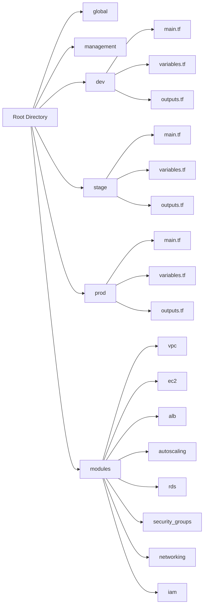
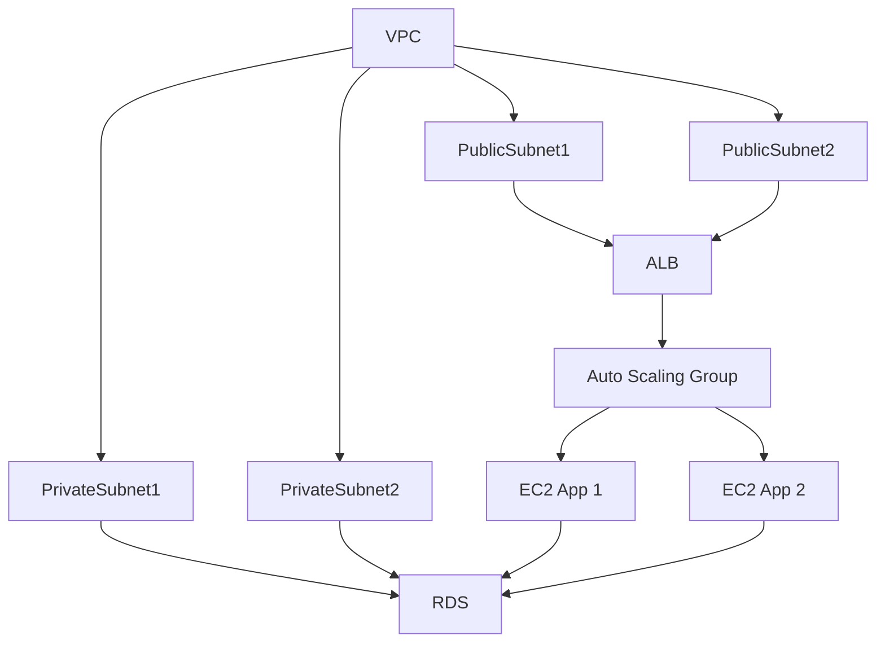

# Terraform AWS 3-Tier Web App Scaffolding (DRY, Modular, HA)

## Overview

This project provides a modular and reusable Terraform setup for deploying a 3-tier web application on AWS. The architecture is designed to be DRY (Don't Repeat Yourself), scalable, and maintainable, following best practices for infrastructure as code.
The setup includes a VPC with public and private subnets, an Application Load Balancer (`ALB`), Auto Scaling Groups (`ASG`) for EC2 instances, and a PostgreSQL RDS instance. The project is structured to support multiple environments (`dev`, `stage`, `prod`) with shared modules for reusability.

### Diagrams

#### Directory Structure

#### Infrastructure Overview

#### Walkthrough

1. `mkdir terraform-aws-webapp && cd terraform-aws-webapp` — Create root project directory.
2. `mkdir dev stage prod global management` — Create environment folders.
3. `mkdir -p modules/{vpc,ec2,alb,autoscaling,rds,security_groups,networking,iam}` — Create reusable modules.
4. `touch {dev,stage,prod}/main.tf {dev,stage,prod}/variables.tf {dev,stage,prod}/outputs.tf` — Add base TF files per environment.
5. `global/main.tf`: Configure AWS provider and backend for shared state.
6. `modules/vpc`: Define VPC, subnets, IGW, NAT, RTs.
7. `modules/security_groups`: Define SGs for ALB, EC2, RDS with secure rules.
8. `modules/alb`: Define ALB, listeners, target groups.
9. `modules/autoscaling`: Define ASG, launch templates, scaling policies.
10. `modules/ec2`: Handle instance AMI, userdata, profiles.
11. `modules/rds`: Define subnet group, Postgres instance, SGs.
12. Wire modules in `dev/main.tf` (and other envs) using inputs and outputs.
13. Define `variables.tf` in each env for module inputs.
14. Define `outputs.tf` in each module/env to expose key values.
15. `cd dev && terraform init && terraform validate` — Initialize and validate setup.
16. (Optional) Add IAM module to manage roles and instance profiles.
17. `terraform plan -out=tfplan` — Preview changes and verify before apply.
18. `terraform apply tfplan` — Apply changes to create infrastructure.
19. `terraform destroy` — Clean up resources when done
